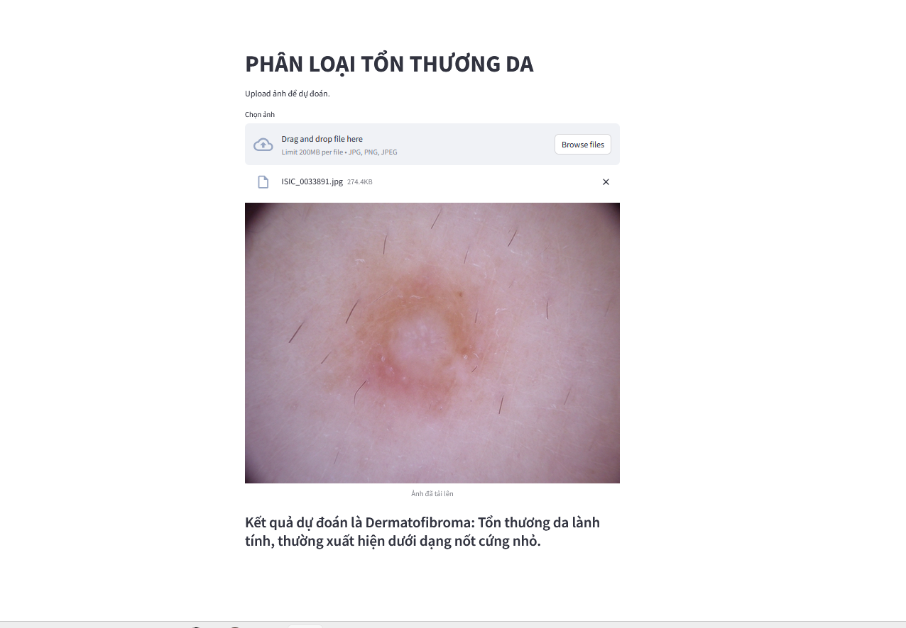

# Skin Lesion Classification Demo

This project demonstrates a skin lesion classification web application using Streamlit, TensorFlow/Keras, and a pre-trained ResNet50 model. It allows users to upload an image of a skin lesion and receive a prediction of the lesion type, along with a brief description.

## Installation

```bash
pip install pip install streamlit numpy tensorflow pillow
```

## Usage

```bash
streamlit run demo.py
```

## Model

*   The model used for classification is a pre-trained ResNet50 model.
*   The model has been trained to recognize the following classes of skin lesions:
    * Melanocytic nevi
    * Melanoma
    * Benign keratosis-like lesions
    * Basal cell carcinoma
    * Actinic keratoses
    * Vascular lesions
    * Dermatofibroma

